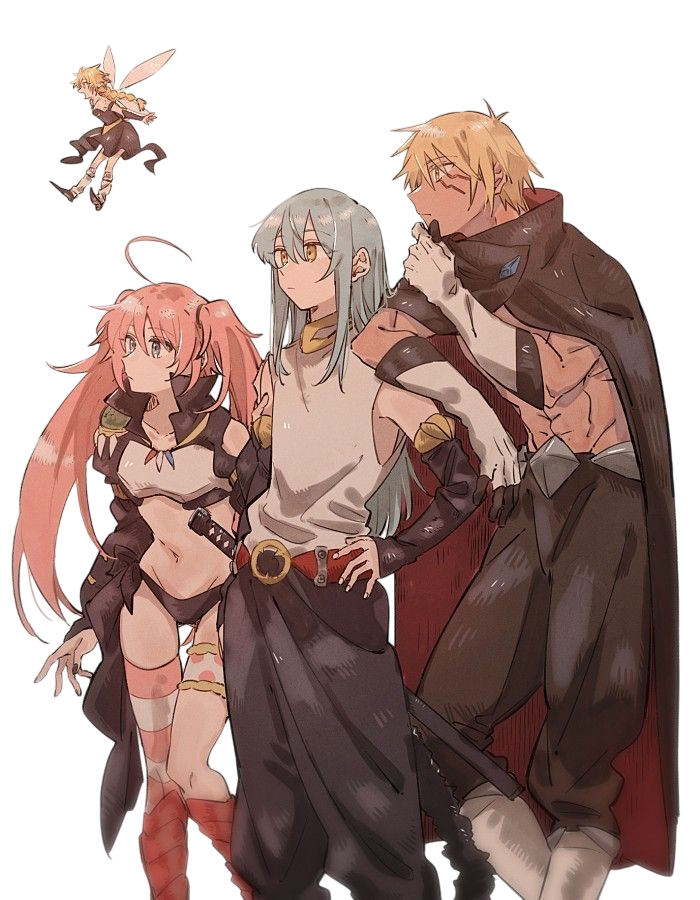

# Rimuru Bot

   <!-- Optional: Add a banner or logo image -->

**Rimuru Bot** is a conversational AI inspired by Rimuru Tempest from the anime *That Time I Got Reincarnated as a Slime*. This bot replicates the personality, knowledge, and versatility of Rimuru, offering an engaging and interactive experience.

## Table of Contents

- [Features](#features)
- [Installation](#installation)
- [Usage](#usage)
- [Configuration](#configuration)
- [Commands](#commands)
- [Contributing](#contributing)
- [License](#license)
- [Acknowledgements](#acknowledgements)

## Features

- **Conversational AI**: Engages in natural, fluid conversations, responding in a manner consistent with Rimuru Tempest's personality.
- **Custom Commands**: Includes commands related to the anime, such as skill activation and lore-based responses.
- **Extensible**: Easily add more features or modify existing ones.
- **Anime-specific Knowledge**: Equipped with trivia and lore from *That Time I Got Reincarnated as a Slime*.

## Installation

To get started with Rimuru Bot, follow these steps:

1. **Clone the repository:**

   ```bash
   git clone https://github.com/yourusername/rimuru-bot.git
   cd rimuru-bot
